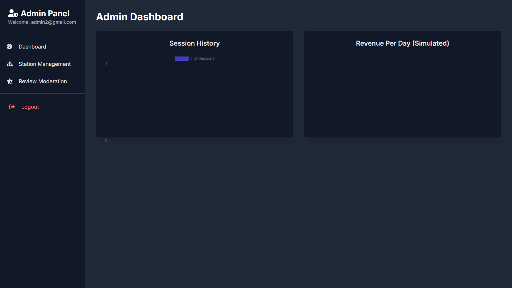

<div align="center">
  
  <h1 align="center">EV ChargeNet: A Real-Time Charging Platform</h1>
  <p align="center">
    A scalable, cloud-native web application engineered to deliver a frictionless electric vehicle charging experience.
    <br />
    <a href="#-live-demo"><strong>View Live Demo</strong></a>
  </p>
</div>

<div align="center">

| **License** | **Contributions** | **Code Style** |
| :---: | :---: | :---: |
| [](https://choosealicense.com/licenses/mit/) | [](http://makeapullrequest.com) | [](https://github.com/prettier/prettier) |

</div>

---

## 1. Executive Summary

### 1.1. The Problem
The rapid adoption of electric vehicles has outpaced the development of a user-friendly charging infrastructure. Drivers currently face a fragmented ecosystem characterized by **range anxiety**, **unpredictable charger availability**, and the need for multiple applications to manage their charging needs. This friction acts as a significant barrier to widespread EV adoption.

### 1.2. The Solution: EV ChargeNet
**EV ChargeNet** is an enterprise-grade platform designed to centralize and simplify the charging experience. It provides a single, reliable source of truth for drivers to locate and use charging stations, while offering powerful administrative tools for network operators. By leveraging a real-time, event-driven architecture, the platform ensures that all data, from slot availability to queue status, is instantaneously accurate.

---

## 2. Photo Gallery & Showcase

### 2.1. User Application
The user-facing application is designed with a clean, intuitive, and responsive interface, available in both light and dark modes.

| Login & Authentication Screen                               | User Dashboard - Map View                                   |
| :----------------------------------------------------------: | :----------------------------------------------------------: |
| *Secure login and registration for both users and admins.* | *Interactive map with real-time station status indicators.* |
|  |  |

| Station List with Live Filtering                           | Detailed Station Modal with Reviews                         |
| :----------------------------------------------------------: | :----------------------------------------------------------: |
| *Card-based view of stations that updates instantly with filters.* | *Comprehensive details, including amenities and user ratings.* |
|  |  |

| Active Charging Session                                    | User Profile & Personal Analytics                           |
| :----------------------------------------------------------: | :----------------------------------------------------------: |
| *Live tracking of charging time, energy delivered, and cost.* | *Manage vehicle, favorites, and view personal usage charts.* |
|  |  |

### 2.2. Admin Panel
The admin panel provides a data-rich interface for complete control over the charging network.

| Admin Dashboard - Network Analytics                        | Station Management (CRUD Operations)                        |
| :----------------------------------------------------------: | :----------------------------------------------------------: |
| *Visualize key metrics like station usage and revenue.* | *A complete interface to create, edit, and delete stations.* |
|  |  |

---

## 3. Features

### 3.1. User Features
* **Authentication**: Secure user registration and login.
* **Interactive Map View**: Find nearby charging stations on a Leaflet-powered map with real-time status indicators.
* **Comprehensive Station List**: View stations in a detailed list format, and search and filter by name, charger type, and amenities.
* **Real-time Availability**: See live slot availability and queue sizes to plan your visit.
* **Booking & Charging Simulation**: Book a charging slot and simulate a charging session with estimates for time and cost based on your vehicle's battery.
* **Session Management**: View your active charging session and a history of past sessions.
* **User Profile**: Manage your profile, set a preferred EV model for better estimates, track loyalty points, and manage a list of favorite stations.
* **Reviews and Ratings**: Leave reviews and ratings for stations to help the community.
* **Light & Dark Mode**: A sleek, modern UI with theme toggling for user comfort.
* **Onboarding Tour**: A guided tour for new users to quickly learn the app's features.

### 3.2. Admin Features
* **Admin Authentication**: Separate, secure login for administrators.
* **Dashboard Analytics**: Visualize key metrics like station usage and revenue on a dedicated dashboard.
* **Station Management (CRUD)**: Create, view, update, and delete charging station details, including location, slots, pricing, and status (Operational/Maintenance).
* **Slot Management**: Update the number of available charging slots in real-time.
* **Review Moderation**: View and delete user-submitted reviews.

---

## 4. Technical Deep Dive

### 4.1. Real-Time Data Synchronization
The platform's core capability is its real-time functionality. This is achieved via **Firestore's `onSnapshot` listeners**, which create a persistent, bidirectional communication channel between the client and the database.

* **Mechanism**: Instead of traditional HTTP polling (`setInterval`), the client subscribes to a Firestore collection. The server then pushes changes to the client as they happen.
* **Efficiency**: This model is highly efficient. Only the data that has changed is transmitted over the network, resulting in minimal latency and reduced data consumption.
* **User Experience**: For the user, this means that map icons, slot availability, and queue positions update instantly without any need for manual page refreshes, creating a fluid and reliable experience.

### 4.2. Firestore Database Schema
The NoSQL database schema is designed for performance and scalability, with data denormalized where necessary to optimize for read-heavy operations.

| Collection | Document ID | Purpose & Key Fields                                                                                                                                      |
| :--- | :--- |:------------------------------------------------------------------------------------------------------------------------------------------------------------------|
| **`users`** | `auth.uid` | Stores user profile data. `role` field is critical for authorization. `profile` object contains user preferences and vehicle data.                                |
| **`stations`** | `auto-id` | The primary data collection. Contains all station details, including geospatial data (`lat`, `lng`), and real-time state (`slots`, `queue`).    |
| **`bookings`** | `auto-id` | A historical log of completed charging sessions. Used for generating user analytics and billing records. Contains foreign keys to `users` and `stations`. |
| **`reviews`** | `auto-id` | Stores user-submitted reviews and ratings. Linked via foreign keys.                                                                                       |

### 4.3. Core Application Logic (`script.js`)
* **`handleLogin()` / `handleRegister()`**: Securely interfaces with Firebase Authentication to manage user sessions.
* **`fetchAndListenForStations()`**: The heart of the real-time functionality. Initializes the `onSnapshot` listener.
* **`renderStationList()` / `updateMarkers()`**: Intelligently re-renders only the necessary DOM elements when data changes, preventing full-page reloads and improving performance.
* **Event Delegation Model**: A single event listener on `document.body` handles all user interactions with dynamic content (e.g., "Book Now" buttons on station cards), which is significantly more memory-efficient than attaching individual listeners.

---

## 5. Getting Started

### 5.1. Prerequisites
* [Node.js](https://nodejs.org/en/) (for package management, if extended)
* A Google Account for Firebase setup.

### 5.2. Installation & Configuration
1.  **Clone the repository:**
    ```sh
    git clone [https://github.com/your-username/your-repo-name.git](https://github.com/your-username/your-repo-name.git)
    cd your-repo-name
    ```
2.  **Set Up Firebase Backend:**
    * Create a project in the [Firebase Console](https://console.firebase.google.com/).
    * Register a new Web App (`</>`) to obtain your `firebaseConfig` keys.
    * Enable **Email/Password** sign-in in the Authentication section.
    * Create a **Firestore Database** and start in **test mode**.
3.  **Configure Environment Variables:**
    * Create a `config.js` file in the project root.
    * Populate it with your `firebaseConfig` object. This file is explicitly ignored by Git.
    ```javascript
    // config.js
    const firebaseConfig = { /* ... your keys here ... */ };
    ```
4.  **Launch the Application:**
    * No build step is required. Simply open `index.html` in a modern web browser.

---

## 6. Security & Deployment

### 6.1. Security
* **API Key Protection**: Keys are stored in an untracked `config.js` file, preventing exposure in the public repository.
* **Firestore Security Rules**: A production deployment would lock down the database. The rules would enforce that:
    * Users can only write to their own `user` document.
    * Admins (verified by a `role` field) have write access to the `stations` collection.
    * All users must be authenticated to read or write any data.
* **Input Sanitization**: Client-side validation is in place, though server-side enforcement via security rules is the ultimate authority.

### 6.2. Deployment
The application is architected for seamless deployment on modern static hosting platforms.
* **Hosting**: Platforms like **Vercel**, **Netlify**, or **GitHub Pages** are ideal.
* **CI/CD Pipeline**: A simple GitHub Actions workflow can be configured to automatically deploy the application to the hosting provider on every push to the `main` branch.

---

## 7. Contributing

Contributions are the lifeblood of open source. We welcome contributions of all forms, from bug reports to feature enhancements. Please read our **[CONTRIBUTING.md](https://github.com/jenishpatel/EVChargeNet/blob/main/CONTRIBUTING.md)** guide for our development process and code of conduct.

---

## 8. License

Distributed under the MIT License. See `LICENSE.txt` for more information.

---

## 9. Contact

Name - [Jenish Dobariya] - jenishdobariya108@gmail.com

Project Link: [https://github.com/jenishpatel/EVChargeNet](https://github.com/jenishpatel/EVChargeNet)
